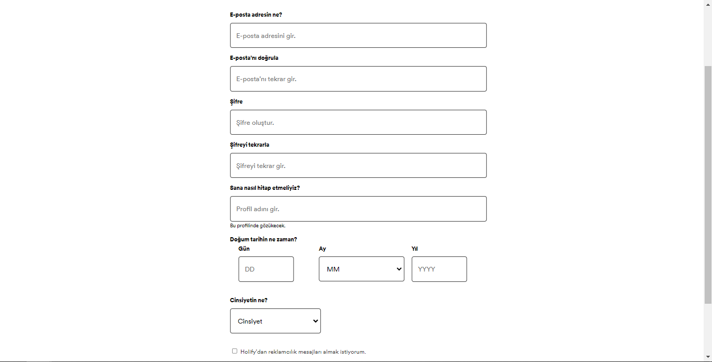
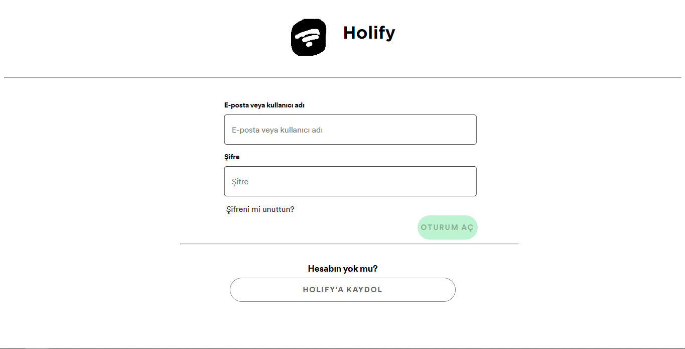
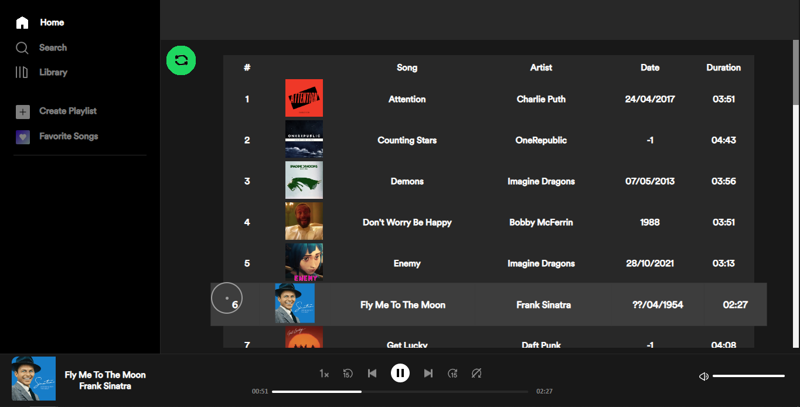

# spotify-clone
A spotify clone that does not look like spotify. Let me introduce you, Holify.

# Setup

Download the repository or just use `git clone git://OguzhanUmutlu/spotify-clone`

Install required dependencies:
```cmd
npm install
```

Run this command to start the server, and you are done! Just enter `http://localhost/` on your browser and listen to your favorite masterpiece...
```cmd
node src/server
```

# Notes

- I haven't added language support to log in/register pages. You can add it if you want to contribute! 

# Screenshots

Register:


Login:


App:
